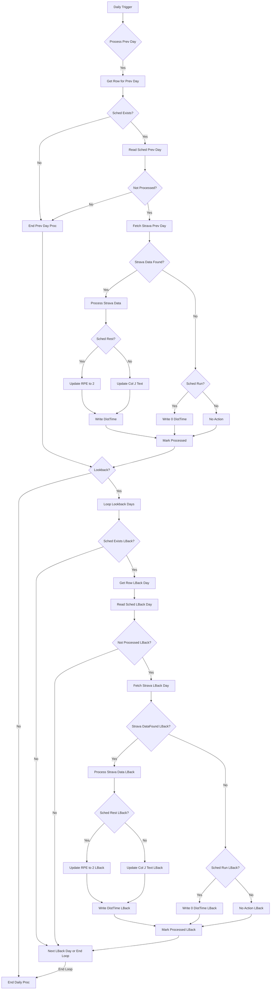

# Business Requirements Document

## Project: Automated Strava to Google Sheets Logging (MVP)

**Version:** 2.0
**Date:** June 6, 2025

---

## 1. Overall Business Case

### 1.1. Background

The user is a runner who meticulously tracks their activities using Strava and is coached by a certified professional. A core part of their coaching process involves the daily input of running distance and time into a Google Spreadsheet, which must adhere to a very specific format prescribed by the coach.

### 1.2. Problem Statement

The current manual process of transferring and formatting data daily from Strava to the Google Spreadsheet presents several challenges:

- **Time-Consuming**: Manual data entry, aggregation of multiple daily runs, and formatting for complex workouts can take between 2 to 10 minutes each day.
- **Tedious**: The repetitive nature of the task is considered a chore.
- **Error-Prone**: Manual entry can lead to inaccuracies in the logged data.
- **Cognitive Load**: The user must actively remember to perform the task and ensure strict adherence to specific formatting rules.
- **Schedule Synchronization Issues**: If the coach updates the training schedule in the spreadsheet late, the user may need to manually retro-fill data.

### 1.3. Proposed Solution High-Level (MVP)

To address these challenges, an automated software system (MVP) is proposed. This system consists of a Configuration Web UI (Frontend) for setup and management, and a Backend System for data processing and logging. The MVP will:

1. Allow a user to securely authorize access to their Strava and Google accounts via the Web UI.
2. Enable the user to specify their target Google Spreadsheet and select their local timezone (pre-filled with a browser-detected default) via the Web UI.
3. The Backend System will run a scheduler that initiates processing for all configured users based on a time window relative to each user's individual timezone.
4. The Backend System will also allow the user to trigger this processing on-demand via the Web UI for an immediate update.
5. The Backend System will process Strava data according to the schedule and predefined rules, including a 7-day lookback for missed entries.
6. The Backend System will automatically input processed data into the Google Spreadsheet, adhering to specific formatting and updating workout descriptions based on performance.
7. The Backend System will provide daily email notifications summarizing processing results.
8. The Web UI will display connection statuses and a historical "Automation Activity Log".

### 1.4. Key Objectives (MVP)

1. **Reduce Mental Load**: Eliminate the cognitive burden of manual data entry.
2. **Simplify Data Aggregation & Reduce Tedium**: Automate complex data input.
3. **Ensure Accurate Formatting Adherence**: Guarantee consistent application of coach's formatting rules.
4. **Eliminate Data Entry Errors**: Remove human error in the training log.
5. **Save Time**: Significantly reduce the daily time commitment required for data logging.
6. **Improve Timeliness and Completeness of Data**: Ensure prompt updates and handle late schedule entries.
7. **Provide Operational Transparency**: Inform the user about daily actions and issues via the Web UI and email.
8. **User-Friendly Configuration**: Provide a web-based UI for initial setup and management of connections, designed with multi-user capabilities in mind.

---

## 2. Business Processes

### 2.1. Proposed Automated Data Logging Process (MVP)

The system will execute operational logic orchestrated by the Backend System after initial configuration via the Web UI. The process can be initiated in two ways:

1. **Automated Scheduled Run:** A scheduler runs periodically (e.g., hourly). For every active user, it checks if the current time falls within their configured local processing window (e.g., 3-5 AM). If so, it dispatches an independent processing job for that user. This allows for parallel processing of many users.
2. **On-Demand Manual Run:** A user can trigger an immediate processing job for their account via the Web UI.

Once a processing job for a user is initiated, it is decoupled from the notification system. The job retrieves the user's configuration and tokens, ensures API access, processes data for the relevant days (current, previous, and lookback), updates the Google Sheet, and records the outcomes. Upon completion, it dispatches a "send notification" job, which then generates and sends the summary email.

**Visual Process Flow (Mermaid.js for Backend System Daily Processing):**

---

## 3. System Requirements (MVP)

### 3.1. Configuration Web UI (Frontend) Requirements

### 3.1.1. User Authentication and Session Management

- **FR-UI-AUTH-001**: The Web UI MUST use Google Sign-In as the exclusive method for user authentication and registration.
- **FR-UI-AUTH-002**: The initial Google Sign-In flow MUST request all necessary permissions (scopes) for basic profile (name, avatar), email (for notifications), and Google Sheets read/write access.
- **FR-UI-AUTH-003**: The Web UI MUST implement secure session management to allow returning users to access their dashboard without re-authenticating with Google on every visit, for the duration of a valid application session.
- **FR-UI-AUTH-004**: A "Sign Out" function MUST be provided to terminate the user's Web UI session without revoking their underlying Google or Strava permissions from the Backend System.

### 3.1.2. Dashboard and Configuration

- **FR-UI-DASH-001**: After signing in, the user MUST be presented with a main dashboard page.
- **FR-UI-DASH-002**: The dashboard MUST display the user's connected Google account status, including their name and avatar.
- **FR-UI-DASH-003**: The dashboard MUST display the connection status for Strava (e.g., "Connected as [Username]", "Not Connected", "Re-authorization Needed").
- **FR-UI-DASH-004**: The dashboard MUST display the currently configured Google Spreadsheet URL/ID and the user's selected timezone.
- **FR-UI-DASH-005**: The dashboard MUST provide user actions to:
    - Connect / Re-authorize / Disconnect the Strava account.
    - Re-authorize Google Permissions.
    - Disconnect Google Account Permissions (which also signs the user out of the UI).
    - Change the configured Google Spreadsheet Link.
    - Change the configured timezone.
- **FR-UI-DASH-006**: The initial setup flow for a new user MUST guide them in a specific order: 1. Google Sign-In (complete), 2. Connect Strava, 3. Configure Spreadsheet & Timezone. UI elements for later steps MUST be disabled or guide the user appropriately until prerequisites are met.
- **FR-UI-DASH-007**: The system MUST allow the user to trigger a manual data sync via a "Manual Sync Now" button on the dashboard, which is only enabled when the user is fully configured.
- **FR-UI-DASH-008**: The dashboard MUST display a concise summary of the last processing run's outcome in an "Automation Activity Log" section.
- **FR-UI-DASH-009**: The dashboard MUST prominently display any alerts if Strava or Google connections require re-authorization (status provided by the Backend System).
- **FR-UI-DASH-010 (Timezone Configuration)**: The UI for setting the user's timezone MUST attempt to detect the user's timezone from their browser and present it as the pre-selected default. The user must be able to confirm or change this selection from a standard list of IANA timezones.

### 3.1.3. Automation Activity Log Display

- **FR-UI-LOGS-001**: The dashboard MUST contain a component that displays a list of the last 30 days of "Automation Activity Log" summaries for the logged-in user.
- **FR-UI-LOGS-002**: This component MUST be scrollable to manage space on the dashboard.
- **FR-UI-LOGS-003**: Each log entry MUST contain the date, status, and concise summary message as defined for email notifications.

### 3.1.4. UI Error Handling

- **FR-UI-ERR-001**: The Web UI MUST display clear, on-screen error messages if an interactive user operation fails (e.g., OAuth flow error, API call to save configuration fails). These UI interaction errors do not need to be logged in the main Backend System log.

### 3.2. Backend System Requirements

### 3.2.1. API for Web UI

- **FR-BE-API-001**: The Backend System MUST expose a secure API for the Web UI to manage user configurations and retrieve data.
- **FR-BE-API-002**: The API MUST provide endpoints to:
    - Handle the handoff of OAuth authorization codes from the UI for Google and Strava.
    - Receive and store user configurations (Spreadsheet ID, Timezone).
    - Provide consolidated dashboard data to the UI (connection statuses, re-auth flags, current config, "Automation Activity Log" summaries).
    - Handle de-authorization requests for Google and Strava.
    - Trigger an on-demand manual data sync for the authenticated user.
- **FR-BE-API-003**: All API endpoints MUST be secured and require a valid session authentication token from the authenticated UI session.

### 3.2.2. User & Configuration Management

- **FR-BE-CONF-001**: The Backend System MUST securely store all user-specific configurations (including encrypted OAuth refresh tokens, profile info, Sheet ID, timezone, and notification preferences) in a persistent datastore (database).
- **FR-BE-CONF-002**: The Backend System's own operational parameters (Database connection details, API configurations, Log Level, Email Service credentials, Automation Schedule) MUST be configured via environment variables.

### 3.2.3. Core Automation Logic

- **FR-BE-CORE-001 (Scheduling)**: The Backend System MUST automatically initiate processing jobs for all active, configured users based on a configured time window (e.g., 3-5 AM) relative to each user's individual stored timezone. The scheduler should run periodically (e.g., hourly) to check which users fall into their processing window.
- **FR-BE-CORE-002 (Token Management)**: The engine MUST manage the lifecycle of short-lived API access tokens by using the long-lived refresh tokens to obtain new ones when needed. It must handle errors during this process, including flagging a user's connection for re-authorization if a refresh token is invalid.
- **FR-BE-CORE-003 (Processing Scope)**: The engine must support distinct processing scopes: a scheduled run (previous day + 7-day lookback) and a manual run (current day so far + previous day + 7-day lookback).
- **FR-BE-CORE-004 (Lookback Logic)**: The lookback process MUST check each of the 7 prior days and only process a day if a schedule entry exists and the day is not considered "processed." A day is considered "processed" if either the text in "Описание на тренировката" is bold OR the "Разстояние" column contains '0'.
- **FR-BE-CORE-005 (Data Transformation)**: All fetched data MUST be processed according to the detailed rules for aggregation, rounding (distance to 0.05km, duration to 5s), and formatting ("HH:MM:SS", comma decimal).
- **FR-BE-CORE-006 (RPE Logic & Description Updates)**: The system MUST correctly apply all defined RPE-based logic, including updating RPE to '2' for runs on a rest day, and parsing/updating the "Описание на тренировката" column based on the detailed rules for RPE 4,5 (Progressive), RPE 6 (Steady State), and RPE 7-9 (Tempo and Interval) workouts.
- **FR-BE-CORE-007 (Marking as Processed)**: The system MUST update the text style in "Описание на тренировката" to bold only after a day's activity has been successfully found and logged.

### 3.2.4. Notifications & Log Recording

- **FR-BE-NOT-001 (Email Generation)**: The Backend System MUST generate and send a single, comprehensive HTML email summary to the user after each completed processing run (both automated and manual).
- **FR-BE-NOT-002 (No Email Condition)**: No email is sent if the sole outcome for all processed days was "Scheduled Rest Day, No Activity."
- **FR-BE-NOT-003 (Log Recording)**: The Backend System MUST create and store a structured outcome record for each processed day in the database to populate the "Automation Activity Log." These records must be retained for at least 30 days.

### 3.2.5. Error Handling

- The Backend System MUST implement robust error handling, including:
    - A configurable retry mechanism with exponential backoff for transient external API errors.
    - Graceful failure for user-specific configuration issues (e.g., bad tokens, inaccessible sheet), allowing the system to continue processing other users.
    - A "fail-fast" mechanism to halt processing on critical system-wide failures (e.g., no database connection).
    - Comprehensive, structured logging for all events and errors.

---

## 4. Non-Functional Requirements (NFRs - MVP)

- **NFR-001 (Usability - Web UI)**: Configuration Web UI MUST be intuitive, easily navigable, ideally as a single-page application or simple flow, with minimal instructions.
- **NFR-002 (Reliability - Backend)**: Backend daily processing MUST achieve >= 99.5% success rate annually per user (assuming external services are up).
- **NFR-003 (Performance - Backend Per User)**: Strava data fetch < 1 min; Sheet update < 1 min post-fetch.
- **NFR-004 (Security - System Wide)**: Secure storage and transit of all credentials (OAuth tokens, client secrets) and PII using encryption. Protection against common web vulnerabilities for the UI.
- **NFR-005 (Maintainability - System Wide)**: Code MUST be well-structured, modular, documented (inline and external) for ease of maintenance and future enhancements.
- **NFR-006 (Scalability - Design Consideration for UI/Backend API)**: Web UI, its API, and database schema SHOULD be designed to support up to ~100 concurrent UI users and 100 total configured users for future growth.
- **NFR-007 (Portability - System Wide)**: System SHOULD be designed for high portability, minimizing OS/platform-specific dependencies (consider containerization).
- **NFR-008 (Accuracy - Backend)**: Data fetched, calculated, and written MUST be accurate per defined rules.
- **NFR-009 (Usability - Notifications)**: Email notifications MUST be clear, timely, and provide actionable information.
- **NFR-010 (Concurrency)**: The Backend System MUST be architected to process multiple users in parallel (e.g., using a job queue, event-driven model) to ensure timely completion of daily automated runs as the number of configured users grows.

---

## 5. Assumptions (for the MVP)

- **A-01 (Third-Party API Stability)**: Strava and Google APIs will remain stable and available without breaking changes without notice.
- **A-02 (Consistent Strava Usage by User)**: Users will consistently record runs on Strava.
- **A-03 (Consistent Use of Manual Laps in Strava)**: Users will use manual laps as expected for detailed workout description updates.
- **A-04 (Spreadsheet Format Adherence)**: The Google Spreadsheet structure and conventions will be maintained.
- **A-05 (Cloud Environment Suitability)**: The chosen cloud environment will support application needs.
- **A-06 (Email Deliverability)**: System-sent emails will generally be deliverable.
- **A-07 (OAuth Credential Validity)**: Application's Client ID/Secret will be correct and valid.
- **A-08 (User Authorization)**: Users will grant necessary OAuth permissions.

---

## 6. Constraints (for the MVP)

- **C-01 (MVP Scope Definition)**: Scope is limited to documented MVP requirements. Post-MVP features (full observability stack, advanced analytics, full-scale multi-user processing) are out of initial scope.
- **C-02 (Reliance on External APIs)**: System is dependent on Strava and Google APIs, their terms, and availability.
- **C-03 (Spreadsheet Language and Structure)**: MVP supports the defined Bulgarian spreadsheet structure only.
- **C-04 (Web-Based Configuration UI)**: Configuration is via the defined web application only.
- **C-05 (Logging to stdout/stderr for MVP Backend)**: Backend logs to stdout/stderr; advanced centralized logging is post-MVP.
- **C-06 (Persistent User-Specific Configuration Storage Need)**: The Backend System requires a robust mechanism (database solution strongly indicated) for persistent, secure storage of user-specific configurations set via the Web UI.
- **C-07 (Development & Deployment by User - Implicit for MVP Context)**: Initial complexity and technology choices might be influenced by the primary user's preferences/skills.

---

## 7. Future Considerations / Post-MVP

- **Multi-user Processing Scalability**: Scaling the Backend System to efficiently process many users daily.
- **Advanced Observability Stack**: Implementation of a centralized logging solution (e.g., Grafana Loki stack recommended) and a metrics collection/monitoring system (e.g., Prometheus & Grafana recommended).
- **System Usage Analytics & Dashboards (for Multi-user version)**.
- **Advanced Error Recovery** beyond MVP definitions.
- **Enhanced User Interface for Configuration**: More features, settings, user management.
- **Support for other activity types or data points from Strava**.
- **More flexible spreadsheet format parsing**.

---

## 8. Identified Dependencies

- **External Services & APIs:**
    - Strava API (for authentication, activity data, lap data).
    - Google OAuth 2.0 (for user authentication to the Web UI, and for API authorization).
    - Google Sheets API (for reading schedule data, writing activity data, updating cell styles).
    - Email Sending Service (for delivering notifications by the Backend System).
- **User & Coach Adherence:**
    - Consistent use of Strava for recording runs by the user.
    - Consistent use of manual laps in Strava by the user for specific workout types requiring description updates.
    - Adherence by the coach/user to the defined Google Spreadsheet structure, column names (Bulgarian), and data conventions.
- **System Configuration & Environment:**
    - Secure and correct configuration of API credentials (Strava Client ID/Secret, Google Client ID/Secret).
    - Secure storage and management of user-specific OAuth refresh tokens by the Backend System.
    - Reliable hosting environment for the continuously running Backend System and the Web UI.
    - Database for the Backend System to store user configurations and operational data.
    - Writable log output (stdout/stderr or configured file path).

---