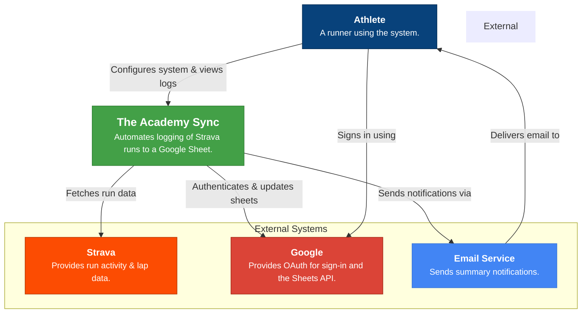
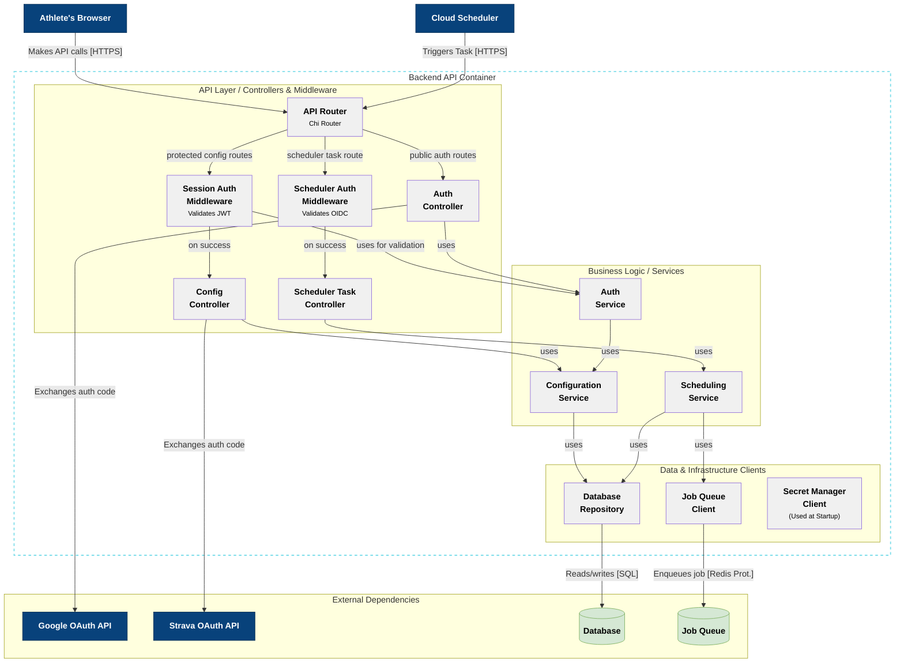
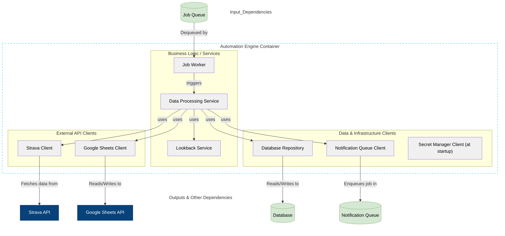
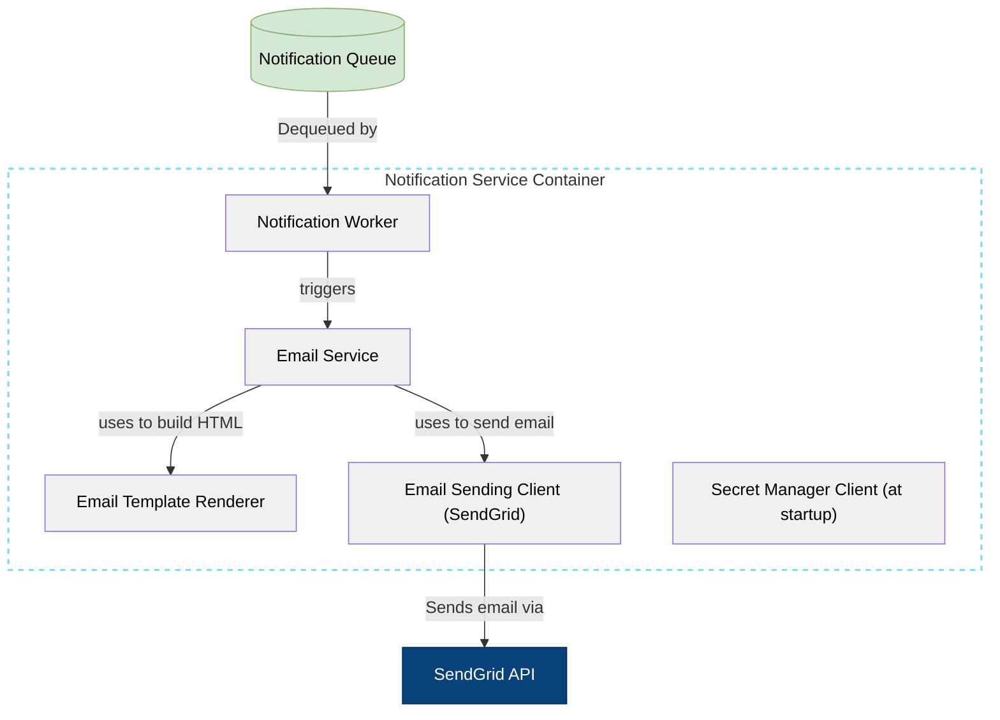
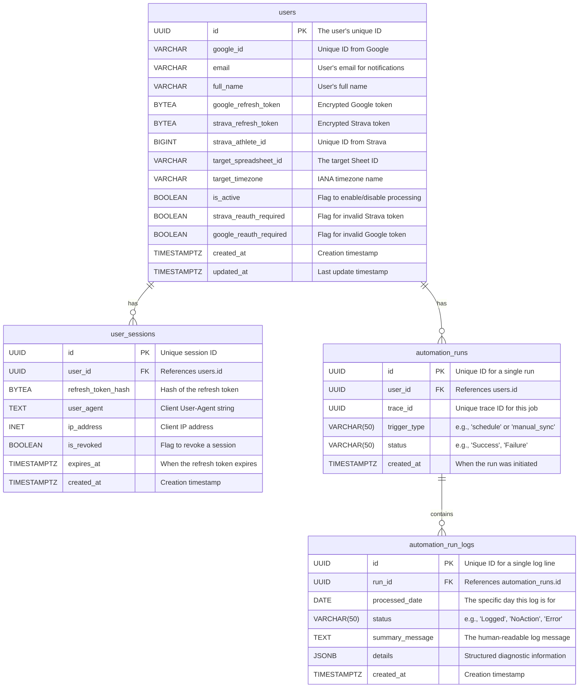

# 1. Introduction & Vision

## 1.1. Purpose

This document outlines the software architecture for **"The Academy Sync"**, a system designed to fully automate the process of logging athletic training data. It provides a comprehensive architectural overview, detailing the system's components, their interactions, data flow, and the design principles followed. This SDD will guide the development, deployment, and future maintenance of the system.

## 1.2. Vision

The vision for "The Academy Sync" is to create a seamless, "set it and forget it" solution that bridges the gap between an athlete's recorded activities on Strava and their coach's prescribed training log in Google Sheets. By automating the tedious, error-prone, and time-consuming task of manual data entry, the system aims to:

- **Eliminate Cognitive Load:** Free the athlete from the daily chore of remembering to log their training.
- **Ensure Data Accuracy & Integrity:** Guarantee that data is logged correctly and adheres to complex formatting rules without human error.
- **Save Valuable Time:** Reclaim the 2-10 minutes spent daily on manual data transfer and formatting.
- **Provide Operational Transparency:** Keep the user informed and confident in the system's operation through clear status reporting and notifications.

Ultimately, "The Academy Sync" will empower athletes to focus purely on their training and recovery, knowing their data is being meticulously managed in the background. The initial MVP will focus on a single user (a runner) but will be architected with the explicit goal of supporting multiple users in the future.

---

# 2. Architectural Goals & Constraints

This section defines the primary quality attributes (architectural goals) that will guide our design choices and the non-negotiable constraints the system must operate within. These are derived directly from the project's Non-Functional Requirements (NFRs) and stated constraints.

## 2.1. Architectural Goals (The "Must-Haves")

- **Reliability (NFR-002, NFR-010):** The system must be highly dependable. This will be achieved through robust error handling, graceful failure for user-specific issues, and a concurrent processing model (e.g., a job queue) that isolates user jobs, preventing one failure from impacting others. The target is a >= 99.5% success rate for daily processing.
- **Security (NFR-004):** Security is paramount. The architecture must ensure all sensitive data, especially user PII and OAuth refresh tokens, are encrypted both in transit (TLS/SSL) and at rest (in the database). The design will protect against common web vulnerabilities and ensure secure API endpoints.
- **Scalability (NFR-006, NFR-010):** While the MVP targets a single user, the architecture must be designed to support future growth up to approximately 100 configured users. This dictates a stateless design for API services and a backend processing model that can handle multiple users in parallel.
- **Maintainability (NFR-005):** The system must be easy to understand, modify, and extend. This will be achieved by designing for modularity, separating concerns between the Web UI, the Backend API, the Core Processing Engine, and the Notification System.
- **Usability (NFR-001, NFR-009):** The user experience is a key driver. The Web UI must be intuitive, and email notifications must be clear, timely, and provide actionable information.
- **Portability (NFR-007):** The system should be easy to deploy and run in different environments. The architecture will favor containerization (e.g., using Docker) to encapsulate the application and its dependencies.
- **Performance (NFR-003):** The processing for any individual user must be efficient, aiming to complete data fetching and spreadsheet updates in under 2 minutes.

## 2.2. Architectural Constraints (The "Must-Follows")

- **Dependency on External Services (C-02):** The system is fundamentally dependent on the availability and terms of service of the Strava API, Google OAuth, and Google Sheets API.
- **Defined MVP Scope (C-01):** The initial design will focus strictly on the features defined for the MVP. Advanced observability and massive-scale processing are out of scope for the initial implementation.
- **Specific Spreadsheet Format (C-03):** The system's logic is tightly coupled to a specific Google Spreadsheet structure with Bulgarian headers for the MVP.
- **Required Persistent Storage (C-06):** The backend requires a persistent database to securely store user configurations, credentials, and logs.
- **Simplified MVP Logging (C-05):** For the MVP, the backend system's logging output will be directed to `stdout`/`stderr`.

---

# 3. System Overview (C4 Level 1: System Context)

This section provides a high-level, "big picture" view of The Academy Sync system. The following System Context diagram illustrates the system's boundaries, its primary user, and the key external systems it interacts with.

## 3.1. Actors & Systems

- **The Academy Sync (Our System):** The core system being designed. It automates the process of fetching run data from Strava, processing it, and logging it into a Google Sheet.
- **Athlete (User):** The primary user of the system who uses the Web UI to configure settings and view logs.
- **Google (External System):** A critical external dependency used for user authentication (Google Sign-In) and for interacting with spreadsheets (Google Sheets API).
- **Strava (External System):** The source of the athlete's training data, accessed via the Strava API.
- **Email Service (External System):** An external email delivery system responsible for sending summary notifications to the Athlete.

## 3.2. System Context Diagram



---

# 4. High-Level Design (C4 Level 2: Containers)

## 4.1. Architectural Approach

The architecture for "The Academy Sync" is designed as a set of cooperating, single-responsibility services that communicate via APIs and asynchronous queues. This microservices-style approach was chosen specifically to meet the system's core architectural goals of **Reliability**, **Scalability**, and **Maintainability**. By decoupling the user-facing API from the background data processing and notification systems, we achieve strong **fault isolation**. A failure or heavy load in one part of the system (e.g., the `Automation Engine`) will not impact the availability of other parts (e.g., the `Web App` and `Backend API`). This design also allows each service to be scaled independently, providing a cost-effective path to supporting a growing number of users.

## 4.2. Container Diagram

```mermaid
graph TD
    U[<div style='font-weight:bold'>Athlete</div>]
    CS[<div style='font-weight:bold'>Cloud Scheduler</div><div style='font-size:0.8em'>GCP Cron Service</div>]

    subgraph The Academy Sync
        direction TB
        
        WebApp["<div style='font-weight:bold'>Web App</div><div style='font-size:0.8em'>React SPA</div>"]
        BackendAPI["<div style='font-weight:bold'>Backend API</div><div style='font-size:0.8em'><b>Go</b> / Chi</div>"]
        
        subgraph Core Processing
            direction LR
            JobQueue["<div style='font-weight:bold'>Job Queue</div><div style='font-size:0.8em'>Redis</div>"]
            AutomationEngine["<div style='font-weight:bold'>Automation Engine</div><div style='font-size:0.8em'><b>Go</b></div>"]
        end

        subgraph Notification Subsystem
            direction LR
            NotifQueue["<div style='font-weight:bold'>Notification Queue</div><div style='font-size:0.8em'>Redis</div>"]
            NotifService["<div style='font-weight:bold'>Notification Service</div><div style='font-size:0.8em'><b>Go</b></div>"]
        end

        DB[("<div style='font-weight:bold'>Database</div><div style='font-size:0.8em'>PostgreSQL</div>")]

        %% Internal Connections
        WebApp -- "Makes API calls [HTTPS]" --> BackendAPI
        BackendAPI -- "Enqueues jobs" --> JobQueue
        BackendAPI -- "Reads/writes user & config data" --> DB
        
        AutomationEngine -- "Dequeues jobs" --> JobQueue
        AutomationEngine -- "Reads config & writes logs" --> DB
        AutomationEngine -- "Enqueues notification job" --> NotifQueue
        
        NotifService -- "Dequeues jobs" --> NotifQueue
    end
    
    subgraph External APIs
        direction LR
        S[<div style='font-weight:bold'>Strava</div>]
        G[<div style='font-weight:bold'>Google</div>]
        E[<div style='font-weight:bold'>SendGrid</div>]
    end

    %% Connections to Users and External Systems
    U -- "Uses [HTTPS]" --> WebApp
    CS -- "Triggers schedule via HTTPS" --> BackendAPI
    BackendAPI -- "Handles OAuth callback [HTTPS]" --> G
    AutomationEngine -- "Fetches run data [HTTPS]" --> S
    AutomationEngine -- "Uses Sheets API [HTTPS]" --> G
    NotifService -- "Sends emails via API" --> E

    %% Styling
    style U fill:#08427b,stroke:#052e56,color:#ffffff
    style CS fill:#4285F4,stroke:#3c78d8,color:#ffffff
    style WebApp fill:#90caf9,stroke:#5d99c6,color:#000
    style BackendAPI fill:#80deea,stroke:#4bacb8,color:#000
    style AutomationEngine fill:#80deea,stroke:#4bacb8,color:#000
    style NotifService fill:#80deea,stroke:#4bacb8,color:#000
    style JobQueue fill:#ffcc80,stroke:#c99a4f,color:#000
    style NotifQueue fill:#ffcc80,stroke:#c99a4f,color:#000
    style DB fill:#b39ddb,stroke:#836fa9,color:#000
    style The Academy Sync fill:none,stroke:#43a047,stroke-width:2px,stroke-dasharray: 5 5
```



## 4.3. Container & System Descriptions

- **Web App (Container):** The user-facing configuration portal. **Technology:** React.
- **Backend API (Container):** A Go service providing the API for the Web App, handling auth, and receiving triggers from Cloud Scheduler. **Technology:** Go (Chi framework).
- **Job Queue (Container):** A queue for core data processing jobs. **Technology:** Redis.
- **Automation Engine (Container):** The core Go service that executes long-running data processing jobs. **Technology:** Go.
- **Notification Queue (Container):** A queue for decoupling notification sending. **Technology:** Redis.
- **Notification Service (Container):** A dedicated Go service that sends emails. **Technology:** Go.
- **Database (Container):** Persistent storage for all application data. **Technology:** PostgreSQL.
- **External Systems:** `Cloud Scheduler`, `Google` (OAuth/Sheets), `Strava`, and `SendGrid`.

## 4.4. Deployment Strategy

The system will be deployed entirely on the **Google Cloud Platform (GCP)**. We will maintain a clear separation between environments, with all cloud resources provisioned and managed via Terraform.

- **Primary Region:** All regional resources will be provisioned in **`europe-central2` (Warsaw, Poland)** to ensure low latency for users in Eastern Europe.

### 4.4.1. Environment Strategy

- **Local:** Runs via `docker-compose` on developer machines without any connection to GCP. Configuration is loaded from `.env` files.
- **Test / Staging:** A deployed environment in GCP for QA, using cost-effective resource tiers (e.g., `Basic` Tier Redis).
- **Production:** The live user-facing environment in GCP, using highly available, production-grade resource tiers.

### 4.4.2. GCP Service Mapping

| Component | GCP Service |
| --- | --- |
| **Web App** | Cloud Storage & Cloud CDN |
| **HTTPS Entrypoint** | Global External HTTPS Load Balancer |
| **Go Services** | Cloud Run |
| **Queues** | Memorystore for Redis |
| **Database** | Cloud SQL for PostgreSQL |
| **Scheduler** | Cloud Scheduler |

## 4.5. Key Design Decisions

- **Backend Framework:** **Chi** has been selected as the web framework for all Go services.
- **Credential Management:** Secrets will be stored in **Google Secret Manager** and accessed via the **Google Cloud client library for Go**. Local development will use `.env` files.
- **Database Access:** Each service will use a dedicated PostgreSQL role with specific privileges:
    - **`backend_api_role`:** `CONNECT`, `SELECT`, `INSERT`, `UPDATE`, `DELETE` on user and configuration tables.
    - **`automation_engine_role`:** `CONNECT`, `SELECT` on configuration tables; `INSERT`, `SELECT` on activity log tables.
- **Infrastructure Management:** All GCP resources will be provisioned using **Terraform**, with work tracked via technical enabler stories.
- **Secret Loading Implementation:** A hybrid secret loading strategy will be implemented in the Go application bootstrap code. This will be tracked by a dedicated technical enabler story:
    - **TECH-005:** `Implement hybrid secret loading strategy (.env for local, Secret Manager for GCP) in the Go application bootstrap code.`

# 5. Detailed Design (C4 Level 3: Components)

This section breaks down the internal structure of specific containers into their major logical components. A component is a grouping of related code (e.g., a set of controllers, a service class, a module) that lives within a container and is not separately deployable.

## 5.1. Container: Backend API

The Backend API container is responsible for handling all synchronous interactions. It's designed as a set of cohesive components that separate concerns like request routing, authentication, business logic, and data access. It uses a sophisticated JWT-based session management system with token refresh capabilities and a secure, OIDC-based mechanism for protecting the scheduler endpoint.

### 5.1.1. Component Diagram



### 5.1.2. Component Descriptions

- **API Router (Chi Router):** The main entry point for all HTTP requests. Routes traffic to the correct middleware and controller chain.
- **Session Auth Middleware:** Protects user-specific routes by extracting the JWT from the `HttpOnly` cookie and using the `Auth Service` to validate it.
- **Scheduler Auth Middleware:** Protects the scheduler task route by validating the Google-signed OIDC token from the request header. This validation is bypassed in local development environments.
- **Auth Controller:** Handles HTTP requests related to user identity. It manages the public Google Sign-In callback and the JWT refresh endpoint. It calls the `Auth Service` to perform the core logic.
- **Config Controller:** Handles authenticated user requests for managing their configuration. This includes initiating the Strava connection and handling the Strava OAuth callback, as this is considered a configuration task. It calls the `Configuration Service`.
- **Scheduler Task Controller:** Exposes the single, OIDC-protected endpoint for Cloud Scheduler and invokes the `Scheduling Service`.
- **Auth Service:** A business logic component responsible for generating and validating JWT access and refresh tokens. It is used by the `AuthController` and `Session Auth Middleware`.
- **Configuration Service:** The business logic component for managing user profiles and service connection settings, interacting with the `Database Repository`.
- **Scheduling Service:** The business logic component for the scheduled run. Finds eligible users via the `Database Repository` and enqueues jobs via the `Job Queue Client`.
- **Database Repository:** Encapsulates all database interaction logic (CRUD operations) for all other components.
- **Job Queue Client:** Encapsulates the logic for connecting to and enqueuing jobs in the Redis `Job Queue`.
- **Secret Manager Client:** An infrastructure component used at application startup to fetch secrets from Google Secret Manager.

### 5.1.3. API Endpoint Definitions

| Method | Route | Controller | Protection | Description |
| --- | --- | --- | --- | --- |
| GET | `/auth/google/login` | AuthController | Public | Redirects the user to Google's OAuth consent screen. |
| GET | `/auth/google/callback` | AuthController | Public | Handles callback from Google, issues session JWTs via `HttpOnly` cookie. |
| POST | `/auth/refresh` | AuthController | Public | Uses the refresh token (from cookie) to issue a new pair of tokens. |
| GET | `/config/strava/connect` | ConfigController | Session JWT | Redirects the user to Strava's OAuth consent screen. |
| GET | `/config/strava/callback` | ConfigController | Session JWT | Handles callback from Strava for an already logged-in user. |
| GET | `/dashboard` | ConfigController | Session JWT | Fetches all consolidated data for the user's dashboard. |
| POST | `/config/spreadsheet` | ConfigController | Session JWT | Updates the user's configured spreadsheet link. |
| POST | `/config/timezone` | ConfigController | Session JWT | Updates the user's configured timezone. |
| POST | `/sync` | ConfigController | Session JWT | Triggers an immediate, on-demand manual sync for the user. |
| DELETE | `/connections/strava` | ConfigController | Session JWT | Disconnects the user's Strava account. |
| DELETE | `/connections/google` | ConfigController | Session JWT | Disconnects the user's Google account permissions. |
| POST | `/tasks/invoke-scheduler` | SchedulerController | OIDC Token | Secure endpoint triggered by Cloud Scheduler to run the scheduled job logic. |

### 5.1.4. Session Management (JWT Lifecycle)

This section details the end-to-end strategy for authenticating users and managing their sessions securely. The core of the strategy is using cryptographically signed JSON Web Tokens (JWTs) which are transported via secure, `HttpOnly` cookies.

### Token Types & Lifetime

The system uses a pair of tokens to balance security and user convenience:

- **Access Token:** A short-lived JWT with a lifetime of **15-30 minutes**. Its purpose is to authenticate individual API requests. Its short lifetime minimizes the risk if it were ever compromised.
- **Refresh Token:** A long-lived JWT with a lifetime of **60 days**. Its only purpose is to be exchanged for a new Access Token. It allows users to maintain their session for an extended period without needing to log in again.

### Token Generation (Signing)

All JWTs are generated by the **`Auth Service`** component.

1. **Secret Key:** A single, cryptographically strong **JWT Secret Key** is used for all signing operations. This key is a critical secret.
2. **Secure Storage:** The JWT Secret Key is stored securely in **Google Secret Manager**. It is fetched by the `Secret Manager Client` at application startup and held only in the application's memory. It is never exposed in logs, configuration files, or environment variables.
3. **Process:** To create a token, the `Auth Service` builds a JSON payload with standard claims (e.g., `sub` for user ID, `exp` for expiration time). It then uses a standard Go library and the `HMAC-SHA256` algorithm to combine the payload with the in-memory JWT Secret Key, producing a unique, secure digital signature. The final token string includes this signature.

### Token Validation (Verification)

Token validation is also the responsibility of the **`Auth Service`** and is performed by the **`Session Auth Middleware`** on every protected API request. This process is **stateless**, meaning it does not require a database lookup.

1. **Signature Verification:** The middleware passes the received Access Token to the `Auth Service`. The service uses the same in-memory JWT Secret Key to re-calculate the token's signature. If the calculated signature matches the one on the token, the token is proven to be authentic and has not been tampered with. If they don't match, the token is immediately rejected.
2. **Claims Validation:** If the signature is valid, the service then inspects the token's claims, primarily checking that the current time is before the `exp` (expiration) timestamp.

If both checks pass, the user is considered authenticated.

### Token Storage & Transport (`HttpOnly` Cookies)

To protect against Cross-Site Scripting (XSS) attacks, JWTs are never stored in the browser's Local Storage. Instead, they are transported using secure cookies.

- When tokens are generated, the backend sets them in the browser using the `Set-Cookie` header with these flags:
    - **`HttpOnly`**: Prevents any JavaScript code from accessing the cookie.
    - **`Secure`**: Ensures the cookie is only sent over HTTPS.
    - **`SameSite=Lax`**: Provides strong protection against CSRF attacks.

### Lifecycle Flow

1. **Creation (Login):** Upon successful Google sign-in, the `AuthController` calls the `AuthService` to generate a new access/refresh token pair. It also creates a record in the `user_sessions` table. The tokens are then set as `HttpOnly` cookies in the response.
2. **Refresh:** When the Web UI receives a `401 Unauthorized` response (indicating an expired Access Token), it makes a call to the `/auth/refresh` endpoint. The browser automatically sends the Refresh Token cookie. The `AuthController` validates this token against the `user_sessions` table and, if valid, issues a new token pair, overwriting the old cookies and keeping the user logged in.
3. **Logout:** The user clicks "Sign Out," calling the `/auth/logout` endpoint. The backend revokes the session in the `user_sessions` table and sends back `Set-Cookie` headers with a past expiration date, instructing the browser to immediately delete the token cookies.

### 5.1.5. Related Technical Stories

- **TECH-006:** `Implement OIDC token validation middleware for the scheduler invocation endpoint to ensure secure, authenticated triggers from Cloud Scheduler.`
- **TECH-007:** `Implement secure session management using JWTs (access & refresh tokens) delivered via HttpOnly cookies, including the token refresh and logout mechanisms.`

## 5.2. Container: Automation Engine

The Automation Engine is a non-interactive, background processing service. Its sole purpose is to execute the long-running data processing jobs that are placed in the `Job Queue`. It is designed to be robust, scalable, and entirely decoupled from the user-facing `Backend API`. It fetches data from external providers, applies the core business logic of the application, and updates the user's spreadsheet.

### 5.2.1. Component Diagram



### 5.2.2. Component Descriptions

- **Job Worker:** This is the main entry point and orchestrator for the container. It's a long-running process that continuously polls the `Job Queue` for new jobs. When a job is received, it deconstructs the payload and passes control to the `Data Processing Service` to begin the workflow.
- **Data Processing Service:** This is the central business logic component of the engine. It orchestrates the entire workflow for a single job, such as:
    1. Fetching user configuration from the `Database Repository`.
    2. Calling the `Google Sheets Client` to read the schedule.
    3. Calling the `Strava Client` to fetch running activities.
    4. Applying all the complex data transformation, aggregation, and formatting rules defined in the BRD.
    5. Invoking the `Lookback Service` for historical processing.
    6. Using the `Google Sheets Client` again to write the final results.
    7. Using the `Database Repository` to log the outcome.
    8. Using the `Notification Queue Client` to enqueue a final notification job.
- **Lookback Service:** A specialized business logic component that contains the specific logic for the 7-day lookback. It determines which past days need processing and coordinates with the `Data Processing Service` to execute the logic for those historical days.
- **Strava Client:** This component encapsulates all interactions with the external Strava API. It is responsible for making the API calls to fetch activity and lap data. Crucially, it also contains the logic to manage the Strava API token lifecycle, using the user's stored refresh token to obtain a new access token when needed.
- **Google Sheets Client:** This component encapsulates all interactions with the external Google Sheets API. It handles reading schedule data, writing processed data, and updating cell formatting (e.g., making text bold). It also manages the Google API token lifecycle by handling token refresh operations.
- **Database Repository:** This is a data access component that abstracts all communication with the PostgreSQL database. It provides methods for fetching user configuration (like tokens and spreadsheet ID) and for writing the structured results of a processing run to the `Automation Activity Log` table. This component would likely be a shared library between the `Backend API` and the `Automation Engine`.
- **Notification Queue Client:** A small client component that acts as a wrapper around the Redis client library. It provides a simple method to enqueue a "send notification" payload to the `Notification Queue` after a job is complete.
- **Secret Manager Client:** An infrastructure component used at application startup to fetch the necessary secrets (e.g., database credentials, Google/Strava client secrets) from Google Secret Manager.

## 5.3. Container: Notification Service

The Notification Service is a simple, focused background worker. Its only responsibility is to listen for messages on the `Notification Queue`, construct a formatted HTML email from the message payload, and reliably send it to the user via the external email provider (SendGrid).

### 5.3.1. Component Diagram



### 5.3.2. Component Descriptions

- **Notification Worker:** The main entry point for the container. It's a long-running process that polls the `Notification Queue`. To ensure high throughput, it should be designed as a **concurrent worker pool**, launching a new goroutine to process each notification job in parallel.
- **Email Service:** The core business logic component. It orchestrates the creation and sending of an email. It receives the payload from the worker, invokes the `Email Template Renderer` to generate the HTML, and then calls the `Email Sending Client` to dispatch the email.
- **Email Template Renderer:** A utility component responsible for rendering the final email. It takes the `processed_days` array and other data from the queue payload and injects it into a static HTML template. This component will use Go's standard library **`html/template`** for its security and simplicity, and its output will be passed through a **CSS inliner** library for maximum email client compatibility.
- **Email Sending Client (SendGrid Client):** This component encapsulates all communication with the external SendGrid API. It takes the recipient's details and the rendered HTML body and makes the API call to send the email. It is also responsible for implementing a robust retry mechanism for any transient network or API errors from SendGrid.
- **Secret Manager Client:** An infrastructure component used at application startup to fetch the SendGrid API key from Google Secret Manager.

### 5.3.3. Related Technical Stories

- **TECH-008:** `Design and implement the HTML email template for the daily summary notification.`

# 6. Database Schema

This section defines the schema for the data stored in our PostgreSQL database. An Entity-Relationship Diagram is provided below to visualize the relationships between the tables.



## 6.1. Table: `users`

Stores all information related to a registered user, including their identity, configuration, and encrypted credentials for external services.

| Column Name | Data Type | Constraints | Description |
| --- | --- | --- | --- |
| `id` | `UUID` | `PRIMARY KEY` | The unique identifier for the user in our system. Generated on creation. |
| `google_id` | `VARCHAR(255)` | `NOT NULL, UNIQUE` | The unique subject ID (`sub`) provided by Google Sign-In. |
| `email` | `VARCHAR(255)` | `NOT NULL, UNIQUE` | The user's email address, used for identification and notifications. |
| `full_name` | `VARCHAR(255)` | `NOT NULL` | The user's full name, as provided by Google. |
| `google_refresh_token` | `BYTEA` | `NOT NULL` | The user's encrypted Google OAuth refresh token for Sheets API access. |
| `strava_refresh_token` | `BYTEA` |  | The user's encrypted Strava OAuth refresh token. Can be `NULL` until connected. |
| `strava_athlete_id` | `BIGINT` | `UNIQUE` | The user's numeric athlete ID from Strava. Can be `NULL` until connected. |
| `target_spreadsheet_id` | `VARCHAR(255)` |  | The ID of the Google Spreadsheet to write data to. Can be `NULL` until configured. |
| `target_timezone` | `VARCHAR(100)` | `NOT NULL` | The IANA timezone name for the user (e.g., "Europe/Sofia"). |
| `is_active` | `BOOLEAN` | `NOT NULL, DEFAULT true` | A flag to enable/disable all processing for this user. |
| `strava_reauth_required` | `BOOLEAN` | `NOT NULL, DEFAULT false` | Flag set to `true` if the Strava refresh token becomes invalid. |
| `google_reauth_required` | `BOOLEAN` | `NOT NULL, DEFAULT false` | Flag set to `true` if the Google refresh token becomes invalid. |
| `created_at` | `TIMESTAMPTZ` | `NOT NULL` | The timestamp (with timezone) when the user record was created. |
| `updated_at` | `TIMESTAMPTZ` | `NOT NULL` | The timestamp (with timezone) when the user record was last updated. |

*Note: Storing refresh tokens as `BYTEA` (byte array) is a standard practice for holding encrypted data, as it makes no assumptions about character encoding.*

## 6.2. Table: `user_sessions`

Stores a record for each active long-lived refresh token issued to a user. This allows for server-side session revocation.

| Column Name | Data Type | Constraints | Description |
| --- | --- | --- | --- |
| `id` | `UUID` | `PRIMARY KEY` | The unique identifier for this session record. |
| `user_id` | `UUID` | `NOT NULL, FOREIGN KEY (users.id)` | A reference to the user this session belongs to. Should have `ON DELETE CASCADE`. |
| `refresh_token_hash` | `BYTEA` | `NOT NULL, UNIQUE` | A cryptographic hash (e.g., SHA-256) of the refresh token. We store a hash, not the token itself, for security. |
| `user_agent` | `TEXT` |  | The User-Agent string of the client that initiated the session. Useful for display and auditing. |
| `ip_address` | `INET` |  | The IP address from which the session was created. |
| `is_revoked` | `BOOLEAN` | `NOT NULL, DEFAULT false` | A flag that can be set to `true` to manually revoke this session before it expires. |
| `expires_at` | `TIMESTAMPTZ` | `NOT NULL` | The timestamp when this refresh token and session will expire (60 days from creation). |
| `created_at` | `TIMESTAMPTZ` | `NOT NULL` | The timestamp when the session was created. |

## 6.3. Table: `automation_runs`

Stores a high-level record for each individual execution of the automation process for a given user.

| Column Name | Data Type | Constraints | Description |
| --- | --- | --- | --- |
| `id` | `UUID` | `PRIMARY KEY` | The unique identifier for this specific automation run. |
| `user_id` | `UUID` | `NOT NULL, FOREIGN KEY (users.id)` | A reference to the user this run belongs to. Should have `ON DELETE CASCADE`. |
| `trace_id` | `UUID` | `NOT NULL, UNIQUE` | The unique trace ID for this job, passed from the queue. Useful for debugging. |
| `trigger_type` | `VARCHAR(50)` | `NOT NULL` | How the job was initiated. Value will be one of: `schedule` or `manual_sync`. |
| `status` | `VARCHAR(50)` | `NOT NULL` | The final, overall status of the entire run, e.g., `Success`, `SuccessWithWarnings`, `Failure`. |
| `created_at` | `TIMESTAMPTZ` | `NOT NULL` | The timestamp when the automation run was initiated. |

*Note: In a PostgreSQL implementation, the `trigger_type` and `status` columns are excellent candidates for custom `ENUM` types to ensure data integrity.*

## 6.4. Table: `automation_run_logs`

Stores the detailed, day-by-day outcome for each processed day within a single automation run.

| Column Name | Data Type | Constraints | Description |
| --- | --- | --- | --- |
| `id` | `UUID` | `PRIMARY KEY` | The unique identifier for this specific log entry. |
| `run_id` | `UUID` | `NOT NULL, FOREIGN KEY (automation_runs.id)` | A reference to the parent run this log entry belongs to. Should have `ON DELETE CASCADE`. |
| `processed_date` | `DATE` | `NOT NULL` | The specific calendar date that this log entry pertains to (e.g., '2025-06-08'). |
| `status` | `VARCHAR(50)` | `NOT NULL` | The status for this specific day's processing, e.g., `Logged`, `Warning`, `Error`, `NoAction`. |
| `summary_message` | `TEXT` | `NOT NULL` | The full, human-readable summary message for this day's outcome. |
| `details` | `JSONB` |  | A field to store structured context, especially for errors or warnings (e.g., API error messages). |
| `created_at` | `TIMESTAMPTZ` | `NOT NULL` | The timestamp when this specific log record was created. |

*Note: Using the `JSONB` data type for the `details` column is highly efficient in PostgreSQL and gives us great flexibility for storing rich diagnostic information.*

# 7. Integration Strategy

This section describes the methods and patterns our system will use to integrate with the key external services and APIs it depends on. For all integrations, communication will occur over HTTPS, and all necessary API keys and client secrets will be stored securely in Google Secret Manager.

## 7.1. Google Integration

Our system integrates with Google for two distinct purposes: authentication and spreadsheet manipulation. All interactions will use the official Google API client library for Go.

- **Google OAuth 2.0:**
    - The `Backend API` will interact with Google's standard OAuth 2.0 endpoints:
        - **Authorization Endpoint (`accounts.google.com/o/oauth2/v2/auth`):** Used to redirect the user for authentication and consent.
        - **Token Endpoint (`oauth2.googleapis.com/token`):** Used to exchange an authorization code for access and refresh tokens.
- **Google Sheets API (v4):**
    - The `Google Sheets Client` component will use a set of primary API calls (`spreadsheets.values.get`, `spreadsheets.values.batchUpdate`, `spreadsheets.batchUpdate`).
    - **Authorization:** All calls to the Google Sheets API will be authenticated by including the user-specific **OAuth 2.0 Access Token** in the request headers, handled automatically by the client library.

## 7.2. Strava Integration

Integration with Strava is for authorizing access and fetching activity data via their REST API.

- **Strava OAuth 2.0:**
    - The `Backend API` will interact with Strava's OAuth 2.0 endpoints:
        - **Authorization Endpoint (`www.strava.com/oauth/authorize`):** Used to redirect the user for consent.
        - **Token Endpoint (`www.strava.com/api/v3/oauth/token`):** Used to exchange an authorization code or refresh an existing token.
- **Strava Data API (v3):**
    - The `Strava Client` component will use primary API calls like `GET /api/v3/athlete/activities` and `GET /api/v3/activities/{id}`.
    - **Authorization:** All calls to the Strava Data API will be authenticated by including the user-specific **OAuth 2.0 Access Token** in the `Authorization: Bearer <token>` header of each request.

## 7.3. SendGrid Integration

The `Notification Service` uses SendGrid's REST API to deliver email summaries.

- **SendGrid Mail Send API (v3):**
    - The `Email Sending Client` component will send an HTTP POST request to the **`POST /v3/mail/send`** endpoint.
    - **Authorization:** Authentication for this API call is performed by including our application's secret **SendGrid API Key** in the `Authorization: Bearer <api_key>` header.

# 8. Design Rationale

This section documents the key architectural decisions made for the "The Academy Sync" system, including the alternatives considered and the reasoning behind the final choice. This serves as a valuable reference for future development and maintenance.

## 8.1. Architectural Style: Decoupled Services vs. Monolith

- **Decision:** We have chosen a decoupled, microservices-style architecture composed of several independent services (Backend API, Automation Engine, Notification Service) that communicate asynchronously via message queues.
- **Alternatives Considered:** A single monolithic backend application containing all API, scheduling, and data processing logic.
- **Rationale:** The decoupled approach was chosen primarily to meet our key architectural goals of **Reliability** and **Scalability**.
    - **Fault Isolation (Reliability):** By separating the services, a critical error or crash in the `Automation Engine` will not affect the availability of the user-facing `Backend API`.
    - **Independent Scaling (Scalability):** This design allows each component to be scaled independently on Cloud Run, which is more efficient and cost-effective than scaling a large monolith.
    - **Maintainability:** This approach promotes a clean separation of concerns, making each service simpler to understand, develop, and test in the long run.

## 8.2. Technology Stack Selection

- **Decision:** We have selected a technology stack consisting of **Go** for backend services, **React** for the frontend, **PostgreSQL** for the database, and **Redis** for queuing. All services will be deployed on the **Google Cloud Platform (GCP)**.
- **Alternatives Considered:**
    - **Backend:** Node.js (TypeScript), Python (FastAPI).
    - **Frontend:** Vue.js, Angular.
    - **Database:** MySQL, MongoDB (NoSQL).
    - **Queues:** RabbitMQ, GCP Pub/Sub.
- **Rationale:**
    - **Backend (Go):** Chosen for its high performance, strong static typing, and first-class support for concurrency, which is a perfect fit for our background workers and supports our **Scalability** and **Performance** goals.
    - **Frontend (React):** Chosen due to its massive ecosystem, robust component-based architecture, and its prevalence as the primary target for advanced AI-powered UI generation tools, providing a strategic advantage for rapid development.
    - **Database (PostgreSQL):** Selected for its proven reliability, strict data integrity, and powerful feature set, including excellent support for `JSONB` which supports our **Reliability** and **Accuracy** goals.
    - **Queues (Redis):** Chosen for its exceptional speed, low latency, and simplicity, making it a perfect fit for our **Performance** and **Maintainability** goals.

## 8.3. Session Management: Backend-Handled OAuth with `HttpOnly` Cookies

- **Decision:** We chose a server-side handled OAuth 2.0 flow where our application's session tokens (JWTs) are delivered to the browser exclusively via secure, `HttpOnly` cookies.
- **Alternatives Considered:** A Single-Page Application (SPA) handled OAuth flow where the session JWT is stored in the browser's Local Storage.
- **Rationale:** The decision was driven entirely by the **Security** goal.
    - **XSS Attack Mitigation:** `HttpOnly` cookies are inaccessible to JavaScript, providing robust protection against session token theft via Cross-Site Scripting (XSS) attacks, a common vulnerability when tokens are stored in Local Storage.
    - **`client_secret` Confidentiality:** This server-side flow ensures our application's OAuth `client_secret` is never exposed to the public-facing Web UI.
    - **CSRF Protection:** The use of `HttpOnly` cookies with the `SameSite=Lax` attribute provides a strong, built-in defense against most Cross-Site Request Forgery (CSRF) attacks.

## 8.4. Deployment Strategy: Serverless & Managed Services

- **Decision:** We have chosen to build the entire system on fully managed and serverless services provided by the Google Cloud Platform, including Cloud Run, Cloud Scheduler, Cloud SQL, and Memorystore.
- **Alternatives Considered:**
    - **Infrastructure as a Service (IaaS):** Provisioning and self-managing virtual machines (e.g., Google Compute Engine).
    - **On-Premise Deployment:** Hosting the application on physical servers.
- **Rationale:**
    - This decision was driven by the goals of **Reliability**, **Scalability**, and **Maintainability**.
    - **Reduced Operational Overhead:** Using managed services frees up development time to focus on application features rather than infrastructure management tasks like server patching, security, and backups.
    - **Cost-Effectiveness:** Serverless services like Cloud Run can scale to zero, eliminating the cost of idle servers.
    - **Automatic Scaling & High Availability:** These services are designed to scale automatically and are built on Google's global, resilient infrastructure.

## 8.5. Code Repository Strategy: Monorepo

- **Decision:** We have chosen a **monorepo** structure to house all source code for the project—including all backend services, the frontend UI, and the infrastructure-as-code files—in a single Git repository.
- **Alternatives Considered:**
    1. **Multi-repo (Polyrepo):** A strategy where each service (`Backend API`, `Automation Engine`, `Web App`, etc.) would have its own separate Git repository.
- **Rationale:**
    - For a project of this scale, the monorepo approach was chosen to directly support our goal of **Maintainability** and to improve developer velocity.
    - **Simplified Code Sharing:** This is the most significant advantage. It allows our three Go services to directly import shared packages (like the `Database Repository`) without the overhead of setting up and versioning private Go modules.
    - **Atomic Commits:** Changes that span across multiple parts of the application can be made in a single, atomic commit and reviewed in a single pull request.
    - **Unified Tooling:** It allows us to have a single, top-level configuration for our build tools, linters, and testing scripts.
    - **A proposed directory structure for this monorepo would be:**
        
        ```
        /the-academy-sync/
        ├── cmd/                      # Main Go applications
        │   ├── backend-api/
        │   ├── automation-engine/
        │   └── notification-service/
        ├── internal/                 # Shared private Go packages
        │   └── pkg/
        │       ├── database/         # Our shared DB Repository
        │       └── queue/            # Our shared Queue Client
        ├── web/                      # The React frontend application
        ├── terraform/                # All Terraform Infrastructure as Code
        ├── .github/                  # CI/CD workflows (e.g., GitHub Actions)
        ├── Dockerfile.go             # The single, reusable Go Dockerfile
        └── docker-compose.yml        # For local development
        
        ```